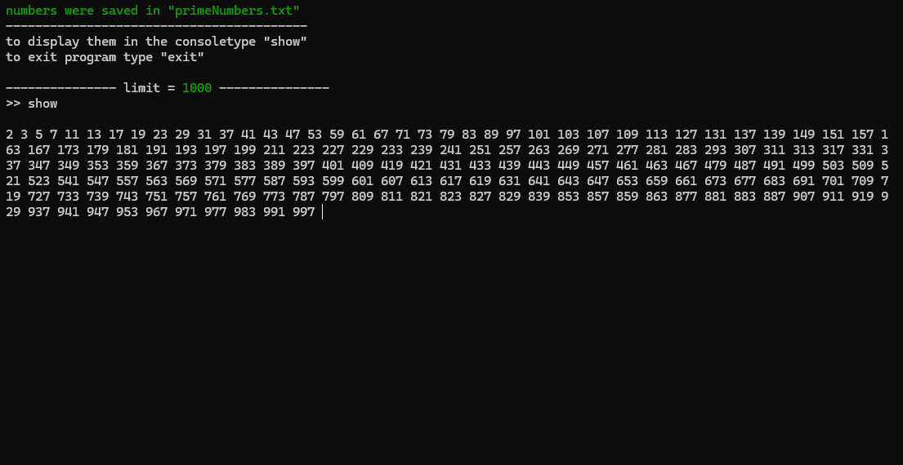

# Prime Numbers Generator v2.0 - Refactored


A refactored **C++17 terminal program** that generates prime numbers up to a user-defined limit.  
This version improves on the original with cleaner code, modular structure, colorful animated output, and file saving functionality. Perfect for learning, experimenting, or quickly generating prime numbers.

---




---

## Features

- Generate all prime numbers up to a specified limit.
- Save prime numbers to `primes.txt` (overwrites previous file).
- Display saved prime numbers in the console.
- Colorful, animated terminal interface with optional delays.
- Efficient prime checking and handling of large numbers.

---

## Custom Library

This project contains a small custom library [`console_writer`](https://github.com/dixe1/UsefulFunctions/tree/main/console_writer) for printing text with optional color and per-character delays.  
Cursor hiding and ANSI colors are used for a clean terminal experience.

---

## Requirements

- CMake 3.25 or newer
- C++17 compatible compiler
- Windows 10/11 or Linux/macOS terminal

---

 ## Build

### 1. Clone the repository
```bash
git clone https://github.com/dixe1/PrimeNumberGenerator
cd PrimeNumberGenerator
```

### 2. Build Project

#### For Visual Studio 2022:
```bash
cmake -G "Visual Studio 17 2022" -A x64 . -B build
```

#### For Visual Studio 2019:
```bash
cmake -G "Visual Studio 16 2019" -A x64 . -B build
```

#### For Linux / macOS (Unix Makefiles):
```bash
cmake -G "Unix Makefiles" -B build
cmake --build build
```
